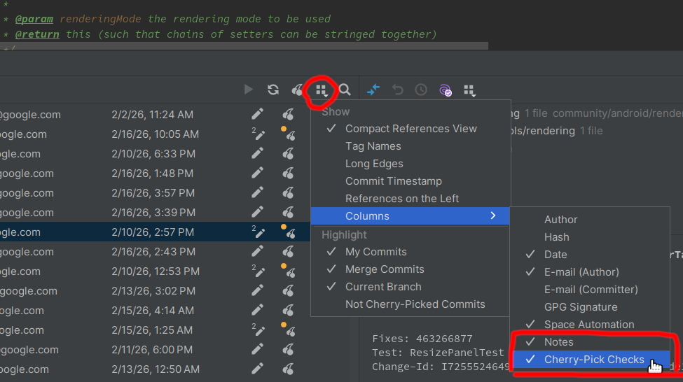
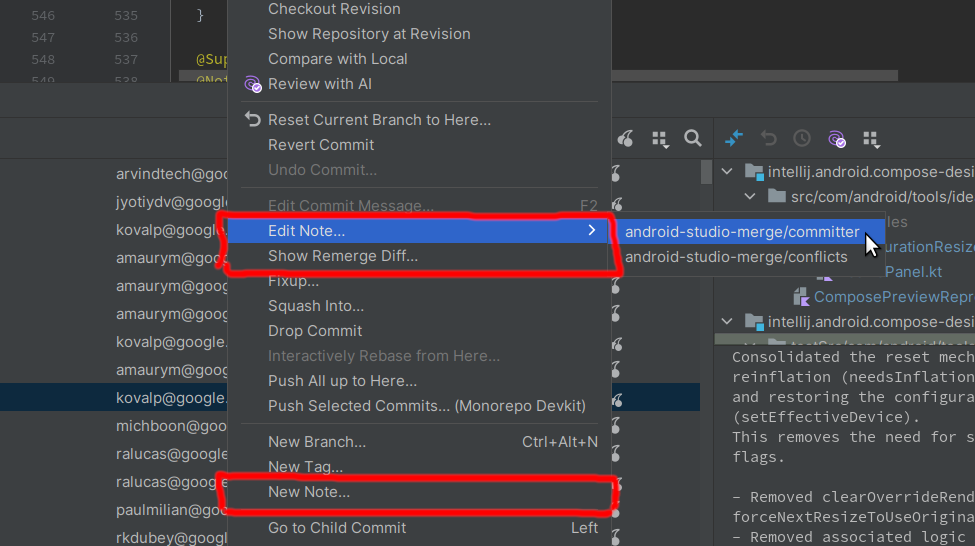

# Git Notes

This minimal plugin adds support for [git-notes](https://git-scm.com/docs/git-notes) in IntelliJ IDEA.

## Quick Start

* `./gradlew runIde` - run IDE with installed plugin
* `./gradlew buildPlugin` - save installer to `build/distributions/intellij-git-notes-<version>.zip`
* `./gradlew verifyPlugin` - run compatibility check against different IDE versions
* `./gradlew publishPlugin -Ptoken=TOKEN` - upload new version to the JetBrains Marketplace

## Screenshots

